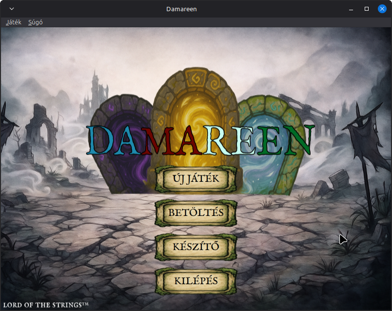
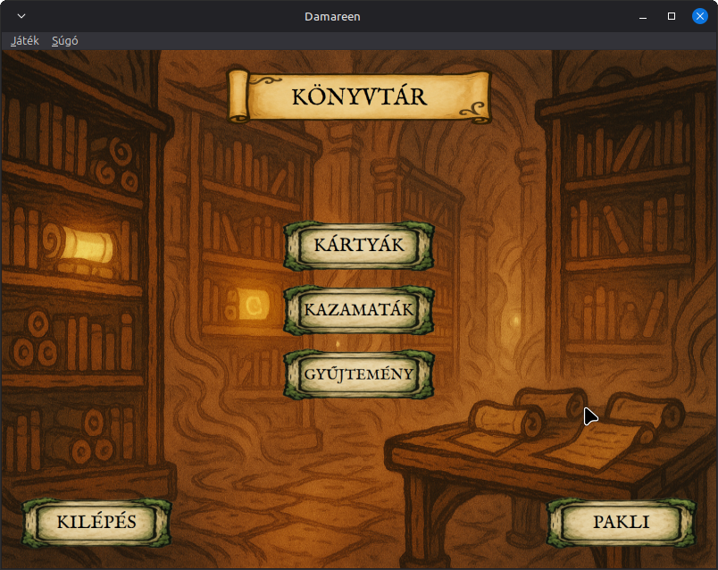
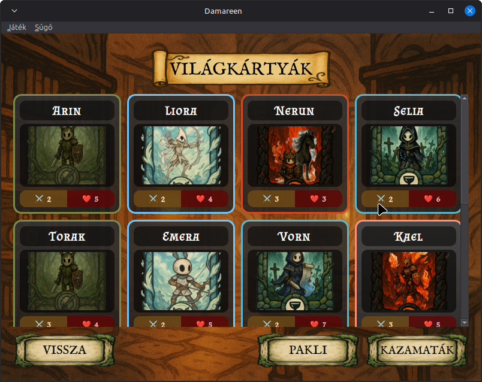
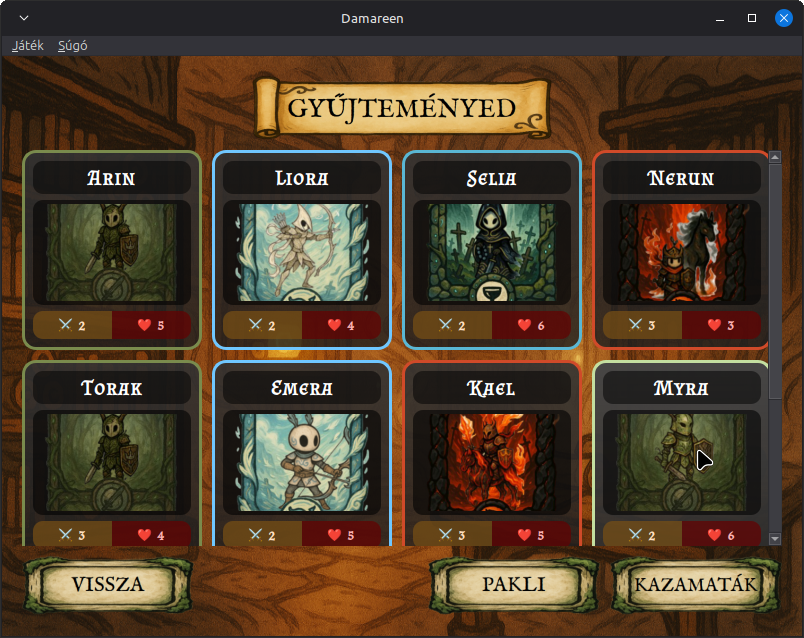
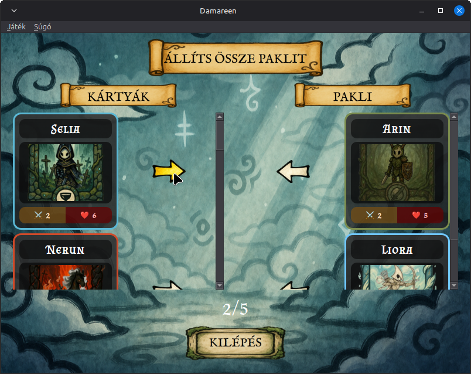
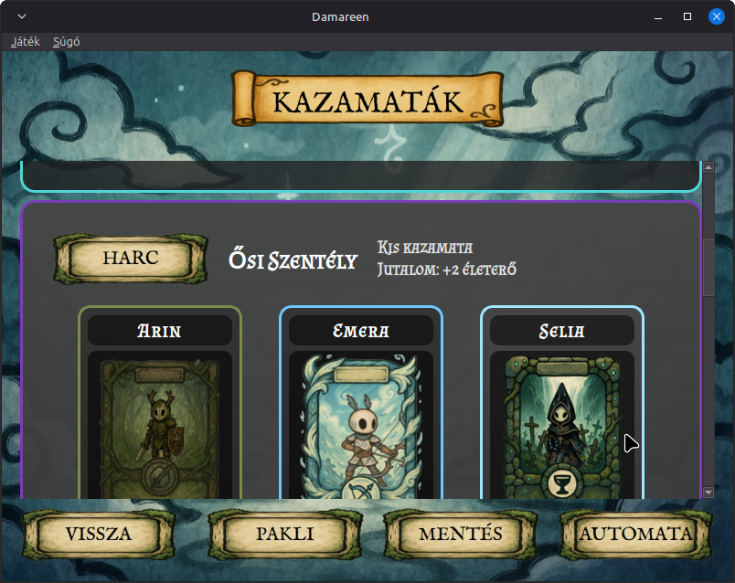
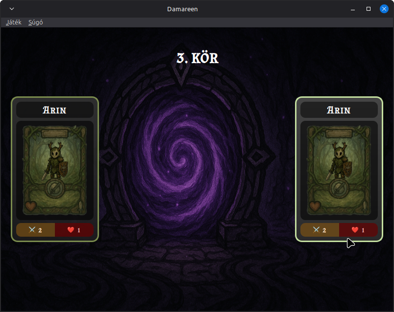
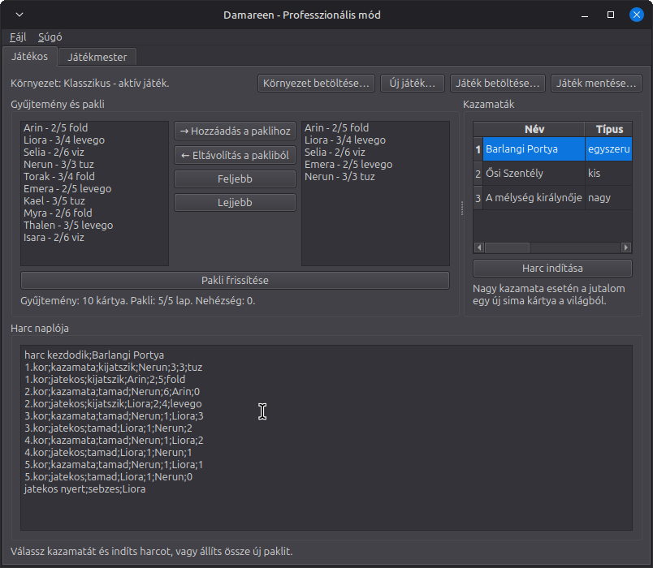
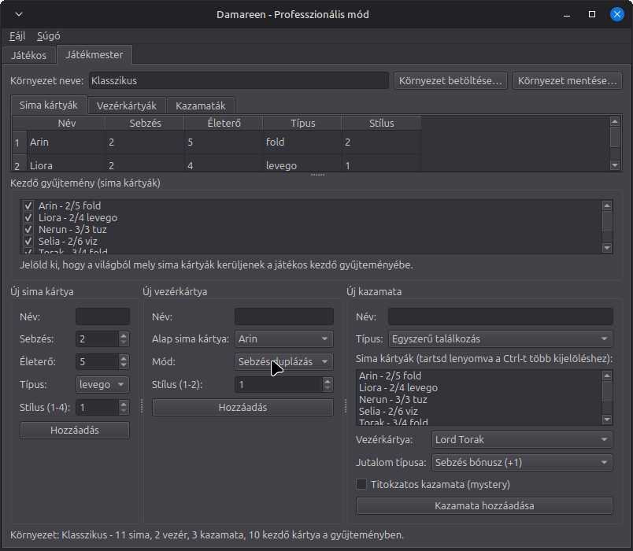

# Damareen

A gyűjtögetős fantasy kártyajáték, amelyben **stratégia**, **szerencse** és **képzelet** fonódik össze. A selyemutak játszóasztalaitól a modern digitális arénákig ez a műfaj mindig is a **hősök** és **történetek** kovácsa volt. Most **RAJTAD** (🫵) a sor, hogy saját paklid lapjaira írd a történelmet: **hősöket teremts**, **kazamatákon küzdj végig**, és **szörnyek vezéreivel mérkőzz meg**.

Vajon a gondosan kidolgozott stratégiád diadalt arat, vagy a kazamaták mélye örökre elnyel?

**Készítsd elő a paklidat, mert a kártyák sorsot hordoznak!**

---

## Telepítés

A játék futtatásához **PySide6**-ra van szükség.

Telepítsd a Python-t, majd a PySide6 csomagot.

`pip install PySide6`

## Használat

A programnak 3 különböző módja van:

- **Teszt mód:** Ebben a módban a játék belső logikája kerül tesztelésre egy `in.txt` fájl alapján.

- **Játék mód:** Ebben a módban lehet magát a játékot használni.

- **Profi mód:** Ebben a módban lehet környezetet készíteni, valamint fejlesztői szemmel játszani.

### Teszt mód

Teszt módban futtatáshoz a programot a teszteset mappájával, mint paraméterrel indítjuk el.

Példa parancs: `python main.py test_cases/01`

A futás eredénye ugyanabba a mappába kerül kiíratásra a tesztesetben meghatározott fájlokba.

### Játék mód

Játék módban futtatáshoz a programot a `--ui` paraméterrel indítjuk el.

Példa parancs: `python main.py --ui`

Ha a programnak nincs paraméter megadva, automatikusan a játék módot indítja el.

### Profi mód

Profi módban futtatáshoz a programot a `--tool` paraméterrel indítjuk el.

Példa parancs: `python main.py --tool`

## Játékkörnyezetek

A játékkörnyezetek alapértelmezett mappája az `Environments`. Alapból 2 környezetet találhatsz:

- **Klasszikus**: A verseny I. fordulójában leírt környezet.
    
    - 11 sima kártya
    - 2 vezérkártya
    - 3 kazamata

- **Lynnä**: Saját készítésű környezet, a még 2022-ben készült nyelvemből használ neveket.

    - 78 sima kártya
    - 6 vezérkártya
    - 16 kazamata (6 titokzatos kazamata)

## Képernyőképek

---

#### Lord(s) of the Strings - 2025